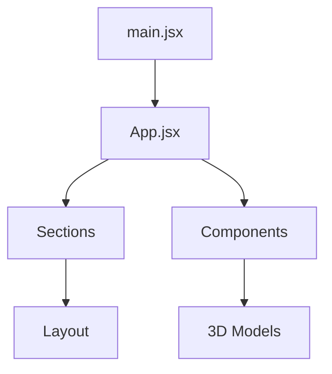

# Three.js Portfolio Documentation

## Models Documentation

### 1. Developer Model
**File**: Developer.jsx
```markdown
- Purpose: Main character model with animations
- Format: GLB/FBX
- Size: 395.08KB (optimized from 981.62KB)

Components:
1. Skeletal Structure
   - Root: Hips
   - Body parts: Wolf3D_Body, Wolf3D_Outfit
   - Face: EyeLeft, EyeRight, Wolf3D_Head, Wolf3D_Teeth
   - Accessories: Wolf3D_Glasses, Wolf3D_Hair

Animations:
- idle: Default standing pose
- salute: Greeting gesture
- clapping: Applause animation
- victory: Celebration pose
```

### 2. HackerRoom Model
**File**: HackerRoom.jsx
```markdown
Purpose: Interactive background scene
Key Elements:
- Computer setup
- Ambient lighting
- Room environment
```

## Section Documentation

### 1. Hero Section
**File**: Hero.jsx
```markdown
Purpose: Landing page introduction
Components:
- Hero text with animation
- 3D model integration
- Call-to-action buttons
Styling:
- Responsive text sizing
- Gradient text effects
```

### 2. About Section
**File**: About.jsx
```markdown
Purpose: Personal information and skills
Features:
- Grid layout of skills
- Tech stack display
- Personal introduction
Styling:
- Grid container system
- Responsive design
```

### 3. Experience Section
**File**: Exp.jsx
```markdown
Purpose: Work history display
Features:
- Interactive 3D model
- Work timeline
- Animation triggers

Components:
1. Canvas Container
   - 3D model display
   - Lighting setup
   - OrbitControls

2. Content Display
   - Work cards
   - Animation triggers
   - Company information
```

### 4. Projects Section
**File**: Projects.jsx
```markdown
Purpose: Portfolio showcase
Features:
- Project cards
- Tech stack icons
- Live demos/links
```

### 5. Contact Section
**File**: Contact.jsx
```markdown
Purpose: Contact form and information
Components:
- Contact form
- Social links
- Email integration
```

## Component Documentation

### 1. CanvasLoader
**File**: CanvasLoader.jsx
```markdown
Purpose: Loading animation for 3D content
Features:
- Progress indicator
- Fallback display
```

### 2. Button Component
**File**: Button.jsx
```markdown
Purpose: Reusable button component
Features:
- Hover effects
- Multiple styles
- Animation support
```

## Styling System

### 1. Main CSS
**File**: index.css
```markdown
Key Features:
- Tailwind integration
- Custom utilities
- Animation keyframes
- Responsive design

Components:
1. Navigation styles
2. Grid systems
3. Button styles
4. Section layouts
```

### 2. Constants
**File**: index.js
```markdown
Purpose: Central configuration
Contains:
- Navigation items
- Project data
- Experience data
- Contact information
```

## Setup Requirements

```markdown
Dependencies:
- @react-three/fiber
- @react-three/drei
- three.js
- tailwindcss

File Structure:
/public
  /models
    /animations
      - developer.glb
      - idle.fbx
      - salute.fbx
      - clapping.fbx
      - victory.fbx

Development:
- Node.js 14+
- npm/yarn
- Vite build system
```

This documentation provides a comprehensive overview of the portfolio project's structure, components, and functionality. Each section is designed to work together to create an interactive and visually appealing portfolio website.


Deep-sarkar02: find the problem in the current ffile

GitHub Copilot: I'll help identify the problems in the current file. Here are the issues I found:

1. **Incorrect Import**:
   - `import { div } from "three/tsl"` appears to be incorrect. The `div` import isn't needed and "three/tsl" is not a valid path.

2. **Syntax Errors**:
   - There's a syntax error in the `.map()` function - extra parenthesis:
   ```jsx
   {workExperiences.map(({id , name , pos , icon , duration , title , animation} , index)) => (
   ```
   should be:
   ```jsx
   {workExperiences.map(({id , name , pos , icon , duration , title , animation} , index) => (
   ```

3. **Missing Import**:
   - `Canvas` component is used but not imported. You need to import it from '@react-three/fiber'

4. **Unclosed JSX**:
   - The `map` function's closing parenthesis is misplaced, causing incomplete JSX structure

Here's the corrected version:

````jsx
import React from "react";
import { Canvas } from "@react-three/fiber";
import { workExperiences } from "../constants";

const Exp = () => {
    return (
        <section className="c-space my-20">
             <div className="w-full text-white-600">
                <h3 className="head-text">
                    My Work
                </h3>

                <div className="work-container">
                    <div className="work-canvas">
                        <Canvas>
                        </Canvas>
                    </div>

                    {/** now we are implement the right side of the experience */}
                    <div className="work-content">
                        <div className="sm:py-10 py-5 sm:px-5 px-2.5">
                            {workExperiences.map(({id, name, pos, icon, duration, title, animation}, index) => (
                                <div key={id} className="work-content_container group">
                                    <div className="flex flex-col h-full justify-center items-center py-2">
                                        <div className="work-content_logo">
                                            
                                        </div>
                                    </div>
                                </div>
                            ))}
                        </div>
                    </div>
                </div> 
             </div>
        </section>
    )
}

export default Exp;
````

These changes will fix the syntax errors and import issues in your component.

Deep-sarkar02: any other issues in the code

GitHub Copilot: Let me review the code for additional issues:

1. **CSS Class Syntax Error**:
```jsx
<p className="group-hover : text-white transition ease-in-out duration-500">
```
Should be:
```jsx
<p className="group-hover:text-white transition ease-in-out duration-500">
```
The space around the colon in `group-hover :` is incorrect in Tailwind CSS syntax.

2. **Inconsistent Spacing**:
- There's inconsistent indentation in the JSX, particularly in the nested divs and Canvas sections
- Extra blank lines between components that could be cleaned up

3. **Comment Style**:
- Using `{/** ... */}` for comments is verbose. For single-line comments in JSX, `{/* ... */}` is sufficient
- Some comments have typos and could be more professional:
  - "now we are implement" should be "now we are implementing"
  - "websidete" should be "website"

Here's the corrected version of the problematic sections:

````jsx
// ...existing code...
                            <Suspense fallback={<CanvasLoader/>}>
                                {/* Developer model component */}
                                <Developer position-y={-3} scale={3}/>
                            </Suspense>
// ...existing code...
                                    <div className="sm:p-5 px-2.5 py-5">
                                        <p className="font-bold text-white-800">
                                            {name}
                                        </p>
                                        <p className="text-sm mb-5">
                                            {pos} -- {duration}
                                        </p>
                                        <p className="group-hover:text-white transition ease-in-out duration-500">
                                            {title}
                                            {/* Model from Ready Player Me with Adobe Mixamo animations */}
                                        </p>
                                    </div>
// ...existing code...
````

4. **Performance Consideration**:
- The `ambientLight` intensity of 7 seems quite high. Consider lowering it to a more standard value (usually between 0.1 and 1)

5. **Accessibility**:
- The `img` tags have generic `alt="logo"` text. Consider using more descriptive alt text using the `name` variable:
```jsx

```

These changes will improve code quality, readability, and accessibility.

Deep-sarkar02: gnerate docs for each of the model and each of the files and how they work and also generate the docs for each of the seections 

GitHub Copilot: # Three.js Portfolio Documentation

## File Structure Documentation

### 1. Developer Component (Developer.jsx)
**Purpose**: Handles the 3D character model and its animations

#### Key Components:
- **Model Loading**
```jsx
const { scene } = useGLTF('/models/animations/developer.glb');
```
- Loads the main 3D model using GLB format

#### Animations:
```jsx
const { animations: idleAnimation } = useFBX('/models/animations/idle.fbx');
const { animations: saluteAnimation } = useFBX('/models/animations/salute.fbx');
const { animations: clappingAnimation } = useFBX('/models/animations/clapping.fbx');
const { animations: victoryAnimation } = useFBX('/models/animations/victory.fbx');
```
- Four main animations loaded from FBX files:
  - `idle`: Default standing position
  - `salute`: Greeting animation
  - `clapping`: Applause animation
  - `victory`: Celebration pose

#### Model Parts:
1. **Base Structure**:
   - `Hips`: Root bone for the skeleton
   - `Wolf3D_Body`: Main body mesh
   - `Wolf3D_Outfit`: Clothing components (Top, Bottom, Footwear)

2. **Facial Features**:
   - `EyeLeft/EyeRight`: Eye meshes with morphTargets
   - `Wolf3D_Head`: Head mesh with morphTargets
   - `Wolf3D_Teeth`: Teeth mesh
   - `Wolf3D_Hair`: Hair mesh
   - `Wolf3D_Glasses`: Glasses accessory

### 2. Experience Section (`Exp.jsx`)
**Purpose**: Displays work experience with interactive 3D model

#### Layout Structure:
1. **Canvas Section**:
```jsx
<div className="work-canvas">
    <Canvas>
        <ambientLight intensity={7} />
        <spotLight position={[10, 10, 10]} angle={0.15} penumbra={1} />
        <directionalLight position={[10, 10, 10]} intensity={1} />
        <OrbitControls enableZoom={false} maxPolarAngle={Math.PI/2} />
        <Developer />
    </Canvas>
</div>
```
- Houses the 3D model with lighting setup
- Controls for model interaction

2. **Work Content Section**:
```jsx
<div className="work-content">
    {workExperiences.map(({id, name, pos, icon, duration, title, animation}, index) => (
        // Experience card content
    ))}
</div>
```
- Displays work experience cards
- Triggers animations on hover/click

#### Interaction Flow:
1. User hovers over work experience card
2. Animation state updates via `setAnimationName`
3. 3D model responds with corresponding animation
4. Returns to idle state when hover ends

### Technical Notes:

#### Model Optimization:
- Original model size: 981.62KB
- Transformed model size: 395.08KB
- 60% size reduction achieved

#### Animation Management:
```jsx
useEffect(() => {
    actions[animationName].reset().fadeIn(0.5).play();
    return () => actions[animationName].fadeOut(0.5);
}, [animationName]);
```
- Smooth transitions between animations
- Cleanup on animation change
- 0.5s fade duration for smooth blending

#### Performance Considerations:
- Uses `Suspense` for lazy loading
- Implements `SkeletonUtils.clone` for efficient model handling
- Preloads GLTF model for faster initial render

---

### Setup Requirements:
- Three.js and related packages (@react-three/fiber, @react-three/drei)
- Model files in correct directory structure:
  ```
  /public/models/animations/
  ├── developer.glb
  ├── idle.fbx
  ├── salute.fbx
  ├── clapping.fbx
  └── victory.fbx
  ```

This documentation covers the main components and their interactions in the 3D portfolio section. Each component is designed to work together to create an interactive experience showcasing work history with animated 3D representations.

Deep-sarkar02: gnerate docs for each of the model and each of the files and how they work and also generate the docs for each of the seections 

GitHub Copilot: # Three.js Portfolio Documentation

## Models Documentation

### 1. Developer Model
**File**: Developer.jsx
```markdown
- Purpose: Main character model with animations
- Format: GLB/FBX
- Size: 395.08KB (optimized from 981.62KB)

Components:
1. Skeletal Structure
   - Root: Hips
   - Body parts: Wolf3D_Body, Wolf3D_Outfit
   - Face: EyeLeft, EyeRight, Wolf3D_Head, Wolf3D_Teeth
   - Accessories: Wolf3D_Glasses, Wolf3D_Hair

Animations:
- idle: Default standing pose
- salute: Greeting gesture
- clapping: Applause animation
- victory: Celebration pose
```

### 2. HackerRoom Model
**File**: HackerRoom.jsx
```markdown
Purpose: Interactive background scene
Key Elements:
- Computer setup
- Ambient lighting
- Room environment
```

## Section Documentation

### 1. Hero Section
**File**: Hero.jsx
```markdown
Purpose: Landing page introduction
Components:
- Hero text with animation
- 3D model integration
- Call-to-action buttons
Styling:
- Responsive text sizing
- Gradient text effects
```

### 2. About Section
**File**: About.jsx
```markdown
Purpose: Personal information and skills
Features:
- Grid layout of skills
- Tech stack display
- Personal introduction
Styling:
- Grid container system
- Responsive design
```

### 3. Experience Section
**File**: Exp.jsx
```markdown
Purpose: Work history display
Features:
- Interactive 3D model
- Work timeline
- Animation triggers

Components:
1. Canvas Container
   - 3D model display
   - Lighting setup
   - OrbitControls

2. Content Display
   - Work cards
   - Animation triggers
   - Company information
```

### 4. Projects Section
**File**: Projects.jsx
```markdown
Purpose: Portfolio showcase
Features:
- Project cards
- Tech stack icons
- Live demos/links
```

### 5. Contact Section
**File**: Contact.jsx
```markdown
Purpose: Contact form and information
Components:
- Contact form
- Social links
- Email integration
```

## Component Documentation

### 1. CanvasLoader
**File**: CanvasLoader.jsx
```markdown
Purpose: Loading animation for 3D content
Features:
- Progress indicator
- Fallback display
```

### 2. Button Component
**File**: Button.jsx
```markdown
Purpose: Reusable button component
Features:
- Hover effects
- Multiple styles
- Animation support
```

## Styling System

### 1. Main CSS
**File**: index.css
```markdown
Key Features:
- Tailwind integration
- Custom utilities
- Animation keyframes
- Responsive design

Components:
1. Navigation styles
2. Grid systems
3. Button styles
4. Section layouts
```

### 2. Constants
**File**: index.js
```markdown
Purpose: Central configuration
Contains:
- Navigation items
- Project data
- Experience data
- Contact information
```

## Setup Requirements

```markdown
Dependencies:
- @react-three/fiber
- @react-three/drei
- three.js
- tailwindcss

File Structure:
/public
  /models
    /animations
      - developer.glb
      - idle.fbx
      - salute.fbx
      - clapping.fbx
      - victory.fbx

Development:
- Node.js 14+
- npm/yarn
- Vite build system
```

This documentation provides a comprehensive overview of the portfolio project's structure, components, and functionality. Each section is designed to work together to create an interactive and visually appealing portfolio website.

Deep-sarkar02: also include how eacj of the files are interreleated with each other and how they are working and 

GitHub Copilot: # Three.js Portfolio Project Documentation

## File Interrelation & Architecture

### Core Application Flow



## 1. Entry Points

### `main.jsx`
```markdown
Primary entry point that initializes the React application:
- Renders the root App component
- Imports global styles from index.css
- Sets up StrictMode
```

### `App.jsx`
```markdown
Main application container:
- Orchestrates section components
- Manages layout structure
- Controls component rendering order
```

## 2. Component Hierarchy

### Section Components
Located in sections

1. **Navbar.jsx**
```markdown
- Imports from: constants/index.js
- Dependencies: Button.jsx
- State Management: Navigation state
- Used by: App.jsx
```

2. **Hero.jsx**
```markdown
- Imports from: components/HeroCamera.jsx, Button.jsx
- Dependencies: Three.js components
- Used by: App.jsx
- Interacts with: Developer.jsx model
```

3. **Experience.jsx & Exp.jsx**
```markdown
- Imports from: components/Developer.jsx, constants/index.js
- Dependencies: Three.js, OrbitControls
- State Management: Animation states
- Used by: App.jsx
```

## 3. Shared Components
Located in components

### 3D Models
```markdown
1. Developer.jsx
   - Used by: Exp.jsx, Hero.jsx
   - Dependencies: Three.js, GLTF loader
   - Assets: /models/animations/

2. HackerRoom.jsx
   - Used by: Hero.jsx
   - Dependencies: Three.js scene components
```

### UI Components
```markdown
1. Button.jsx
   - Used by: Multiple sections
   - Styling: index.css button classes

2. CanvasLoader.jsx
   - Used by: All 3D components
   - Purpose: Loading state management
```

## 4. Data Flow & State Management

### Constants (index.js)
```markdown
Central data store that provides:
- Navigation items
- Work experience data
- Project information
- Contact details

Used by:
- Navbar.jsx
- Projects.jsx
- Experience.jsx
- Contact.jsx
```

### Styling System
```markdown
index.css
- Global styles
- Tailwind utilities
- Custom animations
- Responsive classes

Used by:
- All components
- Section layouts
```

## 5. Asset Management

### Model Files
```markdown
/public/models/animations/
├── developer.glb
├── idle.fbx
├── salute.fbx
├── clapping.fbx
└── victory.fbx

Used by:
- Developer.jsx
- Animation system
```

## 6. Component Communication

### Event Flow
```markdown
1. User Interaction
   Navbar.jsx → App.jsx → Section Components

2. Animation Triggers
   Exp.jsx → Developer.jsx → Animation System

3. State Updates
   Components → Local State → Visual Updates
```

## 7. Dependencies

```json
{
  "major": {
    "@react-three/fiber": "3D rendering",
    "@react-three/drei": "Three.js helpers",
    "three": "3D library",
    "tailwindcss": "Styling"
  }
}
```

## 8. Development Workflow

```markdown
1. Component Development
   - Create component in appropriate directory
   - Import required dependencies
   - Add to App.jsx if section
   - Style in index.css

2. Model Integration
   - Add model files to public/models
   - Create component wrapper
   - Import into sections
```

This documentation outlines how each file and component works together to create the complete portfolio application. The architecture follows a modular approach with clear separation of concerns between sections, components, and data management.
