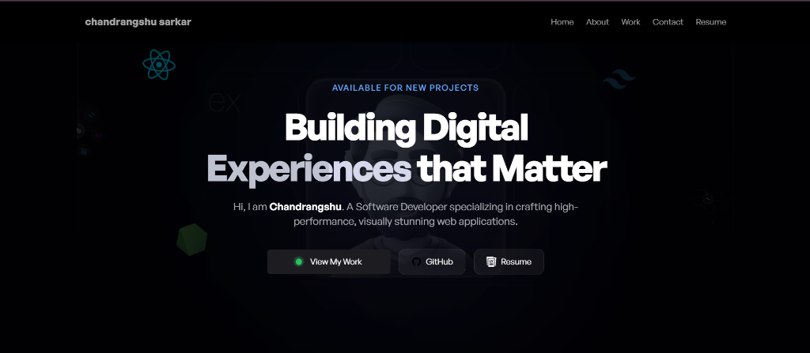

# 🌟 Chandrangshu's 3D Portfolio



Welcome to my professional 3D portfolio! This project showcases a blend of modern web development, sleek animations, and interactive 3D elements to create an immersive user experience.

---

## 🚀 Key Features

- **Immersive 3D Hero Section**: Featuring a floating desk environment and dynamic tech icons.
- **Interactive Experience Display**: A customized 3D character model responding to your interactions.
- **Smooth Animations**: Powered by **Framer Motion** for elegant transitions and scroll effects.
- **Direct Showcases**:
  - **GitHub Profile**: Integrated links to showcase my open-source work.
  - **Resume**: Direct access to my latest professional resume (hosted on Google Drive).
- **Responsive Design**: Optimized for everything from mobile phones up to massive desktop monitors.
- **Contact Integration**: Fully functional contact form powered by **EmailJS**.

---

## 🛠 Tech Stack

- **Core**: [React.js](https://reactjs.org/)
- **Build Tool**: [Vite](https://vitejs.dev/)
- **3D Engine**: [Three.js](https://threejs.org/) (via [@react-three/fiber](https://github.com/pmndrs/react-three-fiber))
- **Styling**: [Tailwind CSS](https://tailwindcss.com/)
- **Animations**: [Framer Motion](https://www.framer.com/motion/)
- **Notifications**: [React-Toastify](https://fkhadra.github.io/react-toastify/)

---

## 📂 Project Structure

- `src/sections/`: Contains the main building blocks of the page (Hero, About, Projects, etc.).
- `src/components/`: Reusable UI components like buttons and loaders.
- `src/constants/`: The single source of truth for all text, links, and data.
- `src/assets/`: Static assets including icons, images, and 3D textures.

---

## 📖 For Beginners

If you're new to coding and want to understand how this project works in detail, check out our **[Deep Dive Project Guide](./Project_Guide.md)**. 

I've also added **line-by-line comments** to all core files in the `src/` directory to help you learn along the way!

---

## 🛠 Getting Started

### Prerequisites
- Node.js installed on your machine.

### Installation
1. Clone the repository.
2. Install dependencies:
   ```bash
   npm install
   ```
3. Run the development server:
   ```bash
   npm run dev
   ```

---

## 📬 Connect with Me

- **GitHub**: [Deep-sarkar02](https://github.com/Deep-sarkar02)
- **Portfolio**: [Live Showcase](/)

---

*Made with ❤️ and a lot of ☕ by Chandrangshu.*
